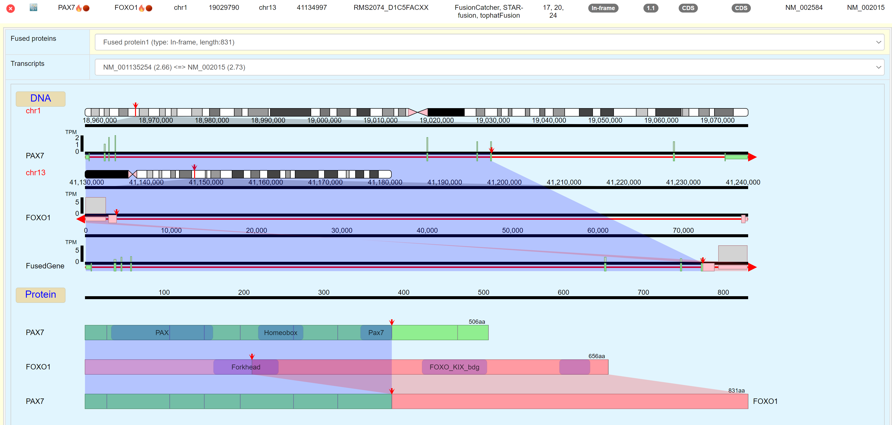

# fusionTools
Python scripts processing fusion breakpoints and visualize them with D3.js

The objectives of fusionTools are:
1. Determine the fusion cDNA and protein sequences
2. Determine the fusion type (in-frame, out-of-frame or right gene intact)
3. Tier the importance of the fusion events
4. Visualize the results in html format

## Installation

### 1. Download Pfam domain database

Please download Pfam domain database: http://ftp.ebi.ac.uk/pub/databases/Pfam/current_release/Pfam-A.hmm.gz
Then
```
module load hmmer
gunzip Pfam-A.hmm.gz
hmmpress Pfam-A.hmm
```

If you do not have hmmer in your system, please goto http://hmmer.org/ to download and install it.

### 2. Download genome FASTA file

You can download the genome FASTA file from: https://www.gencodegenes.org/human/release_36lift37.html or https://hgdownload.soe.ucsc.edu/downloads.html

#### 2.1 Unzip file
Plase unzip/gunzip the file after the file is downloaded.
```
gunzip hg19.fa.gz
```

#### 2.2 Index file
```
samtools faidx hg19.fa.gz
```

### 3.1 Pull Docker/Singularity image

The easiest way to run fusionTool is use docker image.

#### 3.1.1 Docker
```
docker pull hsienchao/fusion_tools:v1
```

#### 3.1.2 Singularity
```
module load singularity
export SINGULARITY_CACHEDIR=/data/somewhere
singularity pull docker://hsienchao/fusion_tools:v1
```

### 3.2 Do not use Docker/Singularity image

If you want to install required packages/softwares by yourself, please follow the instructions:

#### 3.2.1 Pull the code from Github

```
git clone https://github.com/CCRGeneticsBranch/fusionTools.git
```

#### 3.2.1 Python packages

1. Install python 3.7+ in your system.
2. Install required packages:

```
pip install --upgrade gtfparse pyfaidx dataclasses pysam pyyaml Bio numpy pandas pybedtools
```

#### 3.2.2 Hmmer

Hmmer is a tool to predict protein domains. Please download and install by following the instruction on http://hmmer.org/

#### 3.2.3 Add PfamScan Perl global variable

```
export PERL5LIB=/[your installation path]/PfamScan:${PERL5LIB}
```

## Run fusionTool

### Run with Docker

Example:
```
sudo docker run -v /data:/data fusion_tools:v1 fusionTools.py \
	-i /data/processed_DATA/CP02796/RT-0391/Actionable/CP02796.fusion.actionable.txt \
	-o /data/processed_DATA/CP02796/RT-0391/CP02796/db/CP02796.fusion.txt \
	-m /data/processed_DATA/CP02796/RT-0391/CP02796_T2R_T2/RSEM/CP02796_T2R_T2.rsem.isoforms.results \
	-p /data/ref/PfamDB \
	-f /data/ref/hg19.fasta \
	-t 4
```

### Run with Singularity

### Run without Docker/Singularity

#### Process the single fusion file

```
usage: fusionTools.py 

Required:
                      [--input, -i Fusion file]
                      [--output output file ]
                      [--fasta, -f Genome FASTA file]
                      [--pfam_file, -p Pfam domain file]
Optional:
                      [--isoform_expression_file, -m Isoform expression file in RSEM format]
                      [--gtf GTF file]
                      [--canonical_trans_file Canonical transcript list]
                      [--fusion_cancer_gene_list Fusion cancer gene pair list]
                      [--cancer_gene_list Cancer gene list]
                      [--domain_file Pfam domain file]
                      [--threads Number of threads]

```

    gtf: GTF file
    fasta: Genome FASTA file
    isoform_expression_file: RSEM format isoform expression file
    canonical_trans_file: Ensembl canonical transcript file
    fusion_cancer_gene_list: two column fusion gene pair list (default: Sanger Mitelman list)
    cancer_gene_list: one column cancer gene symbol list
    pfam_file: Pfam domain file
    input: input fusion list
    output: output files
    threads: number of threads
    
##### Example
```
module load python
module load hmmer
export PERL5LIB=/your_pfam_scan_path:$PERL5LIB
python fusionTools -g hg19.refseq.gtf -f genome.fa -i fusion_list.txt -o processed_fusion_list.txt -t 16
```

#### Process the case

We also developed a script that can process khanlab pipeline cases:
```
usage: processFusionCase.h 

required:
-d: processed data path
-p: patient ID
-c: case ID
-f: Pfam DB folder
-g: Genome fasta

optional:
-t: number of threads. (default: SLURM_CPUS_PER_TASK variable)
-o: output folder (default: same as input folder)
-v: Gencode version (default: 37)

```

##### Example:

```
./processFusionCase.sh -d /data/Compass/Analysis/ProcessedResults_NexSeq/ExomeRNA_Results \
                       -p CP02796 \
                       -c RT-0391 \
                       -f /data/Clinomics/Ref/khanlab/PfamDB \
                       -g /data/Clinomics/Ref/khanlab/ucsc.hg19.fasta \
                       -v 36

```

Input example
|LeftGene|RightGene|Chr_Left|Position|Chr_Right|Position|Sample|Tool|SpanReadCount|
|------- |-------- |------- |------- |---------|--------|------|----|-------------|
|PAX7|FOXO1|chr1|19029790|chr13|41134997|RMSXXX|FusionCatcher|17|
|PAX7|FOXO1|chr1|19029790|chr13|41134997|RMSXXX|STAR-fusion|20|
|PAX7|FOXO1|chr1|19029790|chr13|41134997|RMSXXX|tophatFusion|24|
|AMD1|FARS2|chr6|111196418|chr6|5545413|RMSXXX|STAR-fusion|2|

Output example:

|left_gene|right_gene|left_chr|right_chr|left_position|right_position|sample_id|tools|type|tier|left_region|right_region|left_trans|right_trans|left_fusion_cancer_gene|right_fusion_cancer_gene|left_cancer_gene|right_cancer_gene|fusion_proteins|left_trans_info|right_trans_info|
|---|---|---|---|---|---|---|---|---|---|---|---|---|---|---|---|---|---|---|---|---|
|PAX7|FOXO1|chr1|19029790|chr13|41134997|RMS2074_D1C5FACXX|[{"FusionCatcher": 17}, {"STAR-fusion": 20}, {"tophatFusion": 24}]|in-frame|1.1|CDS:exon4|CDS:exon2|NM_001135254|NM_002015|Y|Y|Y|Y|{"MAALPGT...VSG*": {"domains": ...}}|...|...|
|AMD1|FARS2|chr6|111196418|chr6|5545413|RMS2074_D1C5FACXX|[{"STAR-fusion": 2}]|out-of-frame|4.3|CDS|CDS|NM_001634|NM_006567|N|N|N|N|{"MEAAHFF...}|...|...|

## Visaulization (not implemented yet)


